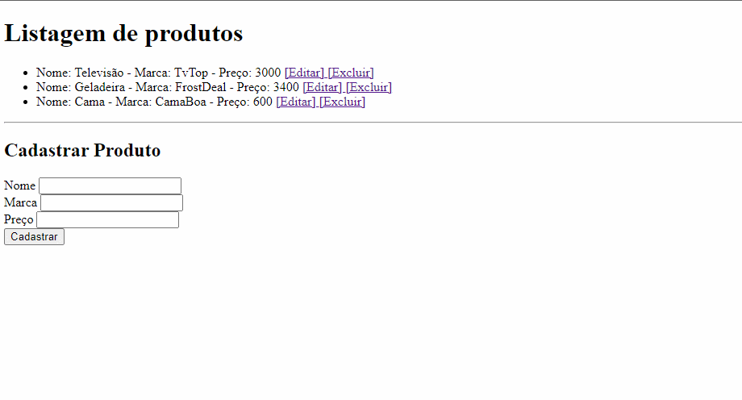

 
  

  &#xa0;

<h1 align="center">Api Restful</h1>

  

  

  

## :dart: Sobre ##

**Interface de Usuário** simples que interage diretamente com o banco de dados **MongoDB**, permitindo cadastrar, editar e excluir itens. 

O servidor foi construído com **Express** e **Mongoose**, seguindo o padrão de **arquitetura MVC**.

Feito com :heart: por <a href="https://github.com/idomelo" target="_blank">Ido Melo</a>
